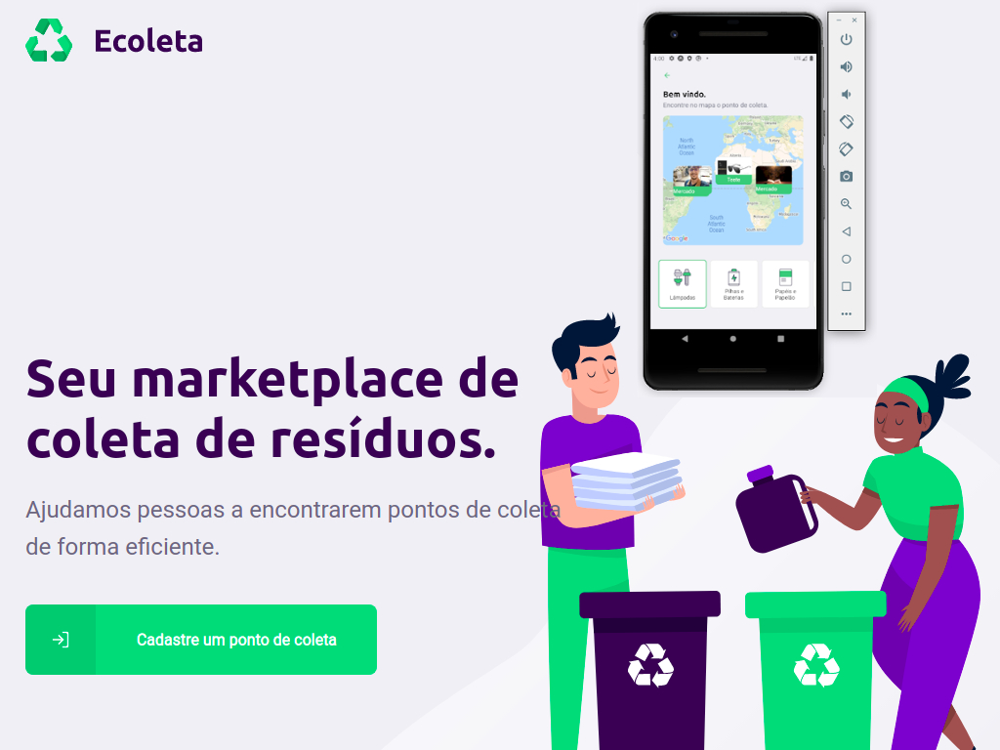

# Ecoleta-App
Integration project backend, frontend and mobile.

We built the "Ecoleta Project" developed in the week nlw #Rockeseat, a regional Marketplace for waste collection points. We use the technologies below:
-Backend: Node.js, Knex.js (for database) and APIRest standard;
-Frontend: React (Web);
-Mobile: ReactNative.

Based on the user's location, making calls to the Google Maps API, we provide the closest collection point and filter by type of material collected.

